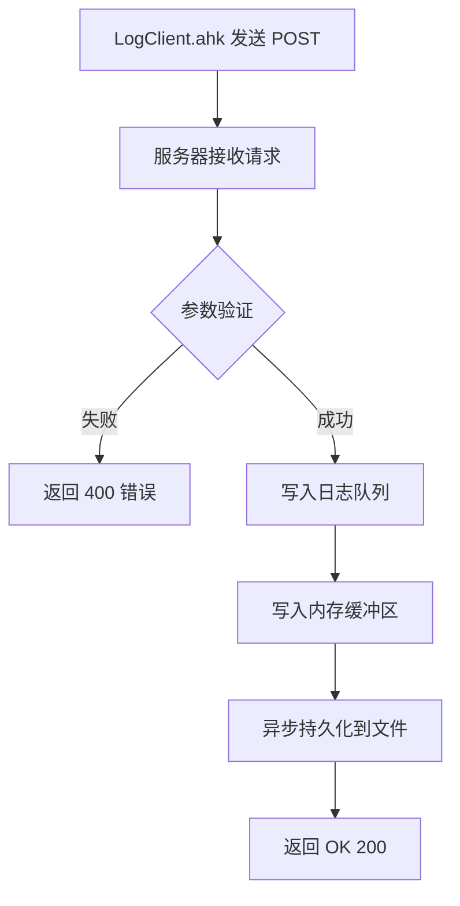
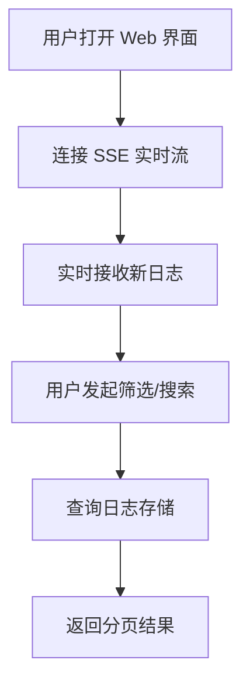

# 日志服务器系统 - 产品需求文档

## 1. 产品概述

一款专为 AutoHotkey 脚本设计的轻量级日志服务器，采用 Go 语言开发，支持实时日志收集、Web 界面可视化查看、历史查询和多维度筛选。解决传统日志分散、难以追踪的问题，为开发者提供统一的日志管理平台。

### 核心价值
- **无缝集成**：与 LogClient.ahk 完美适配，支持所有日志级别（info/warn/error/debug）
- **实时可视化**：Web 界面实时展示日志流，支持按标题、级别、标签筛选
- **高效稳定**：基于 Go 并发模型，支持多客户端同时写入
- **持久化存储**：日志轮转机制，防止磁盘空间耗尽

## 2. 核心功能

### 2.1 用户角色
| 角色 | 权限范围 | 使用场景 |
|------|----------|----------|
| 开发者 | 查看、筛选、搜索日志 | 调试脚本、追踪问题 |
| 系统管理员 | 日志管理、配置调整 | 运维监控 |

### 2.2 功能模块

#### 2.2.1 日志接收模块
- **HTTP POST 接口**：接收来自 LogClient.ahk 的日志请求
- **参数解析**：解析 title、level、tag 查询参数
- **请求体验证**：验证必需参数是否存在
- **响应机制**：返回 "OK" + 200 状态码表示成功

#### 2.2.2 日志存储模块
- **内存缓冲区**：使用 Go channel 实现无锁并发写入队列
- **文件持久化**：JSON Lines 格式存储，便于解析
- **日志轮转**：
  - 按文件大小轮转（单文件最大 10MB）
  - 按时间轮转（每日一个新文件）
  - 保留最近 7 天的日志文件

#### 2.2.3 Web 查看界面
- **实时日志流**：SSE（Server-Sent Events）推送最新日志
- **历史日志列表**：分页展示历史记录
- **多维度筛选**：按标题、级别、标签、关键词搜索
- **日志详情弹窗**：点击查看完整日志内容和时间戳

### 2.3 页面详情

| 页面 | 模块 | 功能描述 |
|------|------|----------|
| 日志仪表盘 | 实时日志流 | 滚动展示最新 100 条日志，实时更新 |
| 日志仪表盘 | 筛选控制栏 | 下拉选择级别、输入标题/标签关键词、日期范围 |
| 日志仪表盘 | 历史日志表格 | 分页展示历史日志，支持排序 |
| 日志仪表盘 | 统计卡片 | 显示今日日志数量、各级别分布饼图 |
| 日志详情 | 模态弹窗 | 显示完整日志内容、元数据、复制功能 |

## 3. 核心流程

### 3.1 日志写入流程


### 3.2 日志查看流程


## 4. 用户界面设计

### 4.1 设计风格
- **主题**：深色专业风格，类似终端/IDE 风格
- **配色方案**：
  - 主背景：#1a1b26（深蓝黑）
  - 卡片背景：#24283b（次深色）
  - 信息级：#7aa2f7（天蓝色）
  - 警告级：#e0af68（琥珀色）
  - 错误级：#f7768e（珊瑚红）
  - 调试级：#9ece6a（草绿色）
  - 文字：#c0caf5（淡蓝白）
- **字体**：JetBrains Mono（等宽字体，日志友好）
- **布局**：左侧筛选栏 + 右侧日志流/表格

### 4.2 响应式设计
- 桌面优先设计（主要使用场景）
- 平板适配：筛选栏折叠为顶部下拉菜单
- 移动端：简化视图，保留核心功能

## 5. API 接口规范

### 5.1 日志写入接口
```
POST /log
```

**请求参数（URL Query）**：
| 参数 | 类型 | 必需 | 说明 |
|------|------|------|------|
| title | string | 是 | 日志标题 |
| level | string | 是 | 日志级别：info/warn/error/debug |
| tag | string | 否 | 标签，用于分类 |

**请求体**：日志消息内容（纯文本）

**响应**：
- 成功：200 OK + "OK"
- 失败：400 Bad Request + 错误信息

### 5.2 日志查询接口
```
GET /api/logs
```

**查询参数**：
| 参数 | 类型 | 说明 |
|------|------|------|
| title | string | 按标题筛选 |
| level | string | 按级别筛选 |
| tag | string | 按标签筛选 |
| keyword | string | 搜索日志内容 |
| page | int | 页码（默认1） |
| pageSize | int | 每页数量（默认50） |
| startTime | string | 开始时间（ISO8601） |
| endTime | string | 结束时间（ISO8601） |

**响应**：
```json
{
  "code": 0,
  "message": "success",
  "data": {
    "logs": [...],
    "total": 100,
    "page": 1,
    "pageSize": 50
  }
}
```

### 5.3 实时日志流（SSE）
```
GET /api/logs/stream
```

通过 Server-Sent Events 实时推送新日志

### 5.4 统计接口
```
GET /api/stats
```

返回今日日志统计：总数、各级别数量
