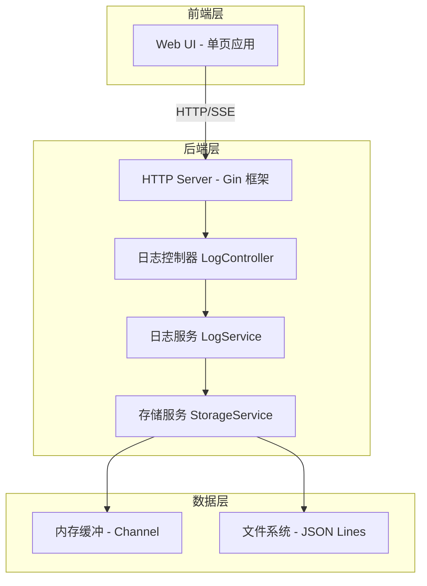

# 日志服务器系统 - 技术架构文档

## 1. 架构设计



## 2. 技术选型

| 层级 | 技术方案 | 说明 |
|------|----------|------|
| 后端框架 | Go 1.21+ / Gin | 高性能 HTTP 框架 |
| 前端框架 | React 18 + Vite | 快速构建单页应用 |
| UI 样式 | Tailwind CSS | 原子化 CSS 方案 |
| 实时通信 | Server-Sent Events | 轻量级实时推送 |
| 日志存储 | JSON Lines 格式 | 每行一条 JSON，便于追加读取 |
| 并发处理 | Go Channel + Goroutine | 原生并发支持 |
| 配置文件 | TOML 格式 | go-toml 库解析 |

## 3. 目录结构

```
log-server/
├── cmd/
│   └── server/
│       └── main.go           # 程序入口
├── internal/
│   ├── config/
│   │   └── config.go          # 配置管理
│   ├── handler/
│   │   └── log_handler.go    # HTTP 处理器
│   ├── service/
│   │   └── log_service.go    # 业务逻辑
│   ├── storage/
│   │   └── file_storage.go   # 文件存储
│   └── model/
│       └── log.go            # 数据模型
├── web/
│   ├── src/
│   │   ├── main.jsx          # React 入口
│   │   ├── App.jsx           # 根组件
│   │   ├── components/      # 组件目录
│   │   ├── hooks/            # 自定义 Hooks
│   │   └── styles/           # 样式文件
│   ├── index.html
│   ├── package.json
│   └── vite.config.js
├── logs/                     # 日志存储目录
├── config.toml               # 配置文件
├── go.mod
├── go.sum
└── README.md
```

## 4. 路由定义

| 路由 | 方法 | 说明 |
|------|------|------|
| `/log` | POST | 接收 AHK 客户端日志 |
| `/api/logs` | GET | 查询日志列表 |
| `/api/logs/stream` | GET | SSE 实时日志流 |
| `/api/stats` | GET | 统计数据 |
| `/` | GET | Web 界面入口 |

## 5. API 接口详细定义

### 5.1 日志写入接口（与 LogClient.ahk 适配）

**POST /log**

Request:
```
POST /log?title=MyScript&level=info&tag=init HTTP/1.1
Host: localhost:29121
Content-Type: text/plain

This is the log message body
```

Response:
```
HTTP/1.1 200 OK
Content-Type: text/plain

OK
```

Error Response:
```
HTTP/1.1 400 Bad Request
Content-Type: text/plain

LogWrite: title 未设置，请先调用 LogSetup(title) 或传入 title
```

### 5.2 日志查询接口

**GET /api/logs**

Request:
```
GET /api/logs?title=MyScript&level=info&page=1&pageSize=50
```

Response:
```typescript
interface ApiResponse<T> {
  code: number;      // 0: success, non-zero: error
  message: string;   // 错误信息
  data: T;           // 响应数据
}

interface LogListResponse {
  logs: LogEntry[];
  total: number;
  page: number;
  pageSize: number;
}

interface LogEntry {
  id: string;
  title: string;
  level: "info" | "warn" | "error" | "debug";
  tag: string;
  message: string;
  timestamp: string;  // ISO8601 格式
}
```

### 5.3 实时日志流

**GET /api/logs/stream**

Response (SSE):
```
Content-Type: text/event-stream

event: log
data: {"id":"xxx","title":"MyScript","level":"info","message":"...","timestamp":"..."}

event: log
data: {"id":"xxx","title":"MyScript","level":"warn","message":"...","timestamp":"..."}
```

### 5.4 统计接口

**GET /api/stats**

Response:
```typescript
interface StatsResponse {
  todayTotal: number;
  byLevel: {
    info: number;
    warn: number;
    error: number;
    debug: number;
  };
}
```

## 6. 数据模型

### 6.1 日志条目模型

```go
type LogEntry struct {
    ID        string    `json:"id"`
    Title     string    `json:"title"`
    Level     string    `json:"level"`
    Tag       string    `json:"tag"`
    Message   string    `json:"message"`
    Timestamp time.Time `json:"timestamp"`
}
```

### 6.2 配置文件模型

```toml
[server]
host = "0.0.0.0"
port = 29121

[storage]
log_dir = "./logs"
max_file_size = 10485760   # 10MB
max_age_days = 7

[buffer]
queue_size = 10000
flush_interval = "1s"
```

## 7. 核心组件设计

### 7.1 日志服务 (LogService)

职责：
- 接收并验证日志条目
- 生成唯一 ID 和时间戳
- 写入内存缓冲区
- 触发持久化操作

### 7.2 存储服务 (StorageService)

职责：
- 管理日志文件轮转
- 异步写入文件
- 提供日志查询接口
- 清理过期日志文件

### 7.3 内存缓冲区设计

使用 Go channel 实现生产者-消费者模式：
- 写入端：接收日志条目，写入 channel
- 消费端：批量从 channel 读取，写入文件
- 缓冲区大小可配置，防止内存溢出

### 7.4 日志轮转策略

| 策略 | 触发条件 | 处理方式 |
|------|----------|----------|
| 大小轮转 | 当前文件 > 10MB | 关闭文件，创建新文件 |
| 日期轮转 | 新的一天 | 按日期命名新文件 |
| 清理轮转 | 服务启动 | 删除 7 天前的日志文件 |
